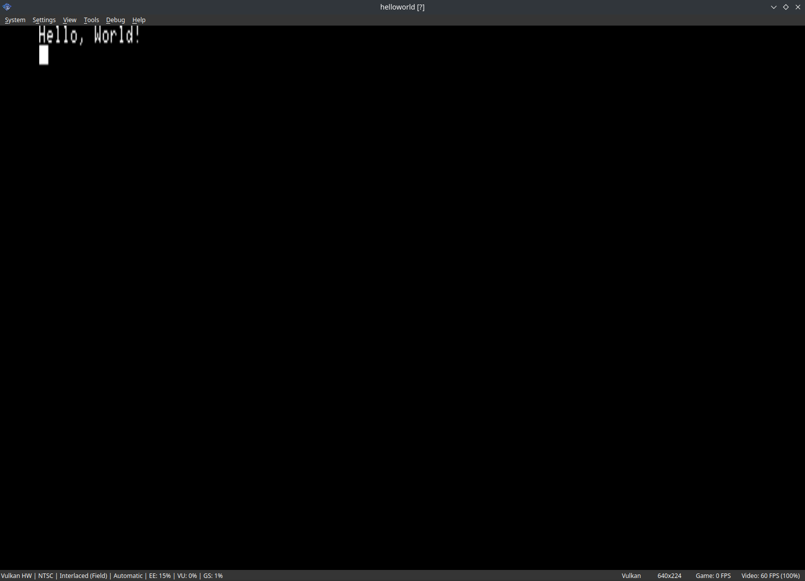
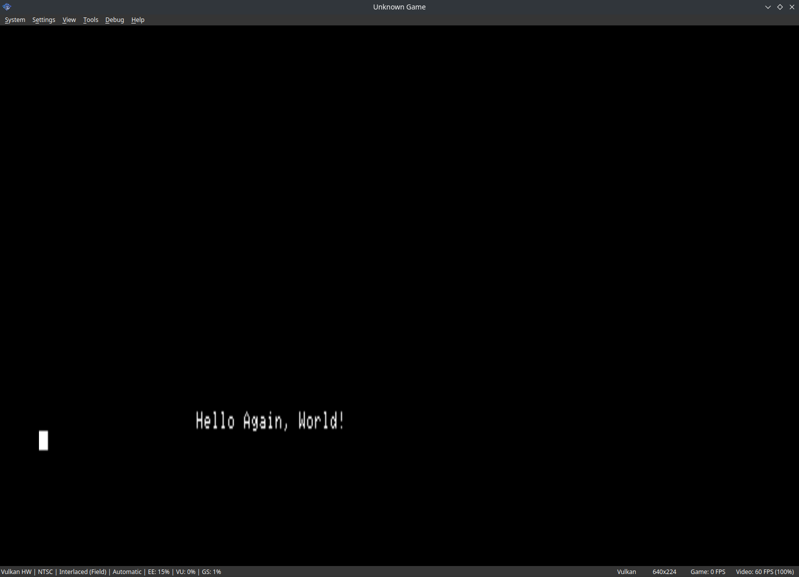

# "Hello, World!"
To ensure that the PS2DEV toolchain installed previously works as intended,
it is recommended to compile an example program, and what better
example is there than the very famous "Hello, World!" example.

For the Docker installation, you must install extra packages afterwards
to compile C/C++ code (with GCC), which can be done using the following command:
```bash
apk add mpc mpc1 mpfr make
```

A "Hello, World!" sample can be found in any PS2 SDK installation and can be copied using the following code:
```bash
cp -r $PS2DEV/ps2sdk/samples/debug/helloworld/ .
```

Next up is to change the current working directory to the `helloworld` folder:
```bash
cd helloworld
```

And finally, to compile the code:
```bash
make
```
This will yield a `helloworld.elf` file which can be run in an emulator.
In Docker containers, this can be transferred to the host by the use of
the `docker cp` command, like so:
```bash
docker cp PS2Dev:/helloworld/helloworld.elf ~/Desktop/helloworld.elf
```

Once ran in an emulator, the words "Hello, World!" should be printed to
the screen. After 5 seconds, this should change to "Hello Again, World!"
at a different position.


